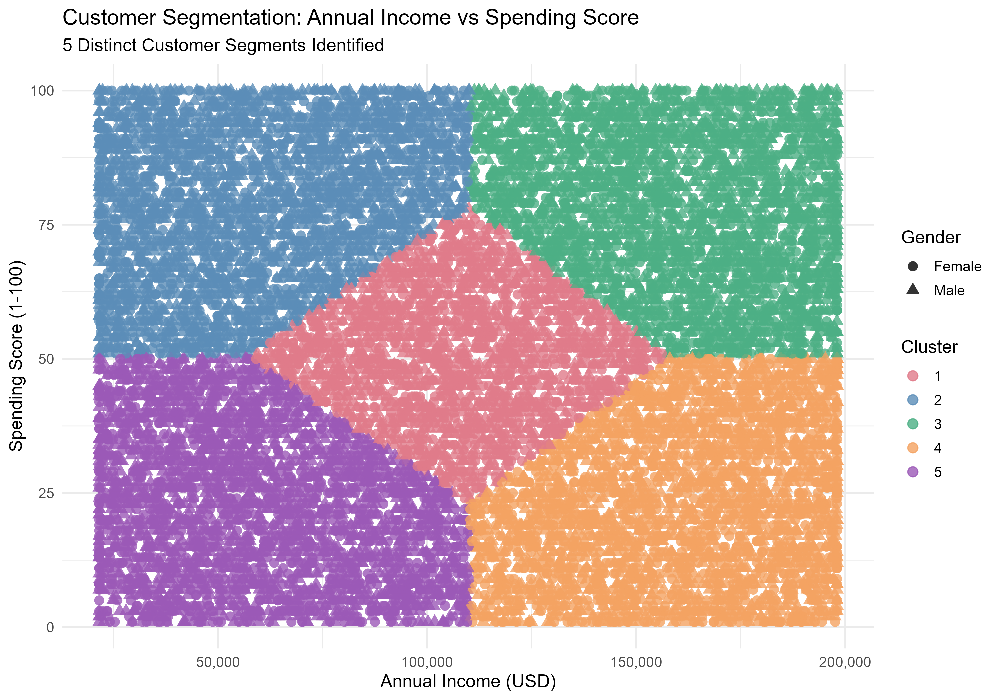

# 🛍️ Shopping Mall Customer Segmentation



> **An end-to-end customer segmentation analysis using K-Means clustering on 15,079 shopping mall customers, identifying 5 distinct behavioral segments to drive targeted marketing strategies.**

---

## 📌 Project Overview

This project applies unsupervised machine learning to segment shopping mall customers based on their **age, annual income, and spending behavior**. Using the K-Means clustering algorithm, 5 meaningful customer groups were identified — each with distinct characteristics and tailored business recommendations.

---

## 🛠️ Tools & Technologies

| Tool | Purpose |
|------|---------|
| **R** | Full analysis pipeline |
| **tidyverse** | Data manipulation and visualization |
| **cluster** | Clustering algorithms and silhouette scoring |
| **factoextra** | Cluster visualization |
| **NbClust** | Optimal cluster determination |
| **clustertend** | Hopkins statistic for cluster tendency |
| **corrplot** | Correlation matrix visualization |
| **ggplot2** | Advanced visualizations |
| **RColorBrewer** | Color palettes |

---

## 📂 Repository Structure

```
📁 customer-segmentation/
│
├── 📄 customer_segmentation.R           ← Full R analysis script
├── 📄 customer_segments_output.csv      ← Segmented customer data
├── 📄 cluster_profile_summary.csv       ← Cluster summary statistics
├── 🖼️  plot_01_gender_distribution.png
├── 🖼️  plot_02_age_distribution.png
├── 🖼️  plot_03_income_distribution.png
├── 🖼️  plot_04_spending_distribution.png
├── 🖼️  plot_05_spending_by_gender.png
├── 🖼️  plot_06_income_vs_spending.png
├── 🖼️  plot_07_age_group_counts.png
├── 🖼️  plot_08_eda_combined_grid.png
├── 🖼️  plot_09_cluster_segments.png     ← Main result visual
├── 🖼️  plot_10_cluster_sizes.png
├── 🖼️  plot_11_cluster_heatmap.png
├── 🖼️  plot_12_age_per_cluster.png
├── 🖼️  plot_13_correlation_matrix.png
├── 🖼️  plot_14_silhouette.png
├── 🖼️  plot_15_elbow_method.png
├── 🖼️  plot_16_silhouette_method.png
├── 🖼️  plot_17_gap_statistic.png
├── 🖼️  plot_18_classic_cluster_plot.png
└── 📄 README.md
```

---

## 📊 Dataset

| Attribute | Details |
|-----------|---------|
| **Source** | Shopping Mall Customer Segmentation Dataset |
| **Records** | 15,079 customers |
| **Columns** | Customer ID, Gender, Age, Annual Income, Spending Score |
| **Income Range** | $20,022 — $199,974 (USD) |
| **Age Range** | 18 — 90 years |
| **Spending Score** | 1 — 100 |

---

## ⚙️ Analysis Pipeline

### Step 1 — Data Cleaning & Preprocessing
- Renamed columns for clarity
- Checked and removed missing values and duplicates
- Encoded Gender (Male = 1, Female = 0)
- Detected outliers using IQR method — capped at 1st and 99th percentile
- Applied z-score normalization (critical for K-Means)

### Step 2 — Feature Engineering
Created the following new features:

| Feature | Description |
|---------|-------------|
| Income_Spending_Ratio | Annual Income / Spending Score |
| Age_Group | Young Adult / Adult / Middle Age / Senior |
| Income_Tier | Low (<$80k) / Mid ($80k–$140k) / High (>$140k) |
| Spending_Category | Low / Moderate / High Spender |

### Step 3 — Exploratory Data Analysis
- Gender and age distribution analysis
- Income and spending score distributions
- Correlation matrix across all numeric features
- Spending behavior by gender and age group

### Step 4 — Optimal Cluster Determination
Three methods used to confirm K = 5:

| Method | Result |
|--------|--------|
| Elbow Method (WSS) | K = 5 |
| Silhouette Method | K = 5 |
| Gap Statistic | K = 2 (overridden by domain knowledge) |
| Hopkins Statistic | > 0.75 (strong cluster tendency confirmed) |

### Step 5 — K-Means Clustering
- Algorithm: K-Means with 25 random starts
- Features used: Annual Income + Spending Score (scaled)
- Optimal K: 5 clusters
- BSS/TSS Ratio: indicates strong cluster separation

---

## 🎯 Cluster Results

| Cluster | Label | Avg Income | Avg Spending | Strategy |
|---------|-------|-----------|-------------|---------|
| 1 | Careful Savers | High | Low | Build trust, premium loyalty programs |
| 2 | Premium Targets | High | High | VIP programs, luxury upselling |
| 3 | Balanced Customers | Mid | Mid | Bundle deals, loyalty points |
| 4 | Impulsive Buyers | Low | High | Flash sales, BNPL options |
| 5 | Budget Conscious | Low | Low | Discounts, everyday low prices |

---

## 📉 Key Findings

- **5 distinct customer segments** identified with clear behavioral differences
- **Premium Targets** (High Income + High Spending) represent the highest revenue opportunity
- **Impulsive Buyers** respond strongly to limited-time promotions despite lower income
- **Careful Savers** need value justification before purchasing — quality messaging over discounts
- Gender distribution is nearly equal across all clusters (~50/50 split)

---

## 🚀 How to Run

```r
# 1. Install required packages (first run only)
install.packages(c("tidyverse", "cluster", "factoextra",
                   "NbClust", "corrplot", "RColorBrewer",
                   "clustertend", "gridExtra"))

# 2. Set working directory
setwd("path/to/your/folder")

# 3. Place dataset CSV in working directory

# 4. Run the script
source("customer_segmentation.R")
```

**Output files generated:**
- `customer_segments_output.csv` — full dataset with cluster labels
- `cluster_profile_summary.csv` — cluster statistics summary
- 18 visualization plots saved as PNG

---

## 👤 Author

**Olusanya Oluwatobi**
- GitHub: [@thibeex](https://github.com/thibeex)

---

## 📄 License

This project is open source and available under the [MIT License](LICENSE).

---

*Part of a 3-project Data Analytics Portfolio — Customer Segmentation (R) | Sentiment Analysis (R) | Financial Dashboard (R + Power BI)*
